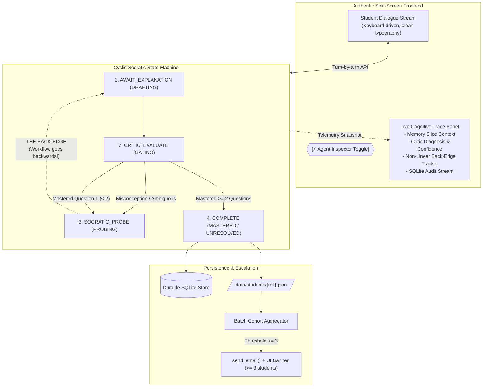

# Feynman Check MVP — Enhanced Implementation Plan

**Target Application:** Socratic Feynman Check & Batch Gap Ping  
**Domain Scope:** Computer Science — Object-Oriented Programming (7 Core Lectures)  
**Aesthetic Standard:** Authentic Engineering & Academic Tooling (Linear / Notion / Vercel style; anti-AI generated feel)  
**Target Environment:** Python 3.12, FastAPI, Uvicorn, SQLite, Clean HTML5/CSS & Vanilla JS  
**Token Safety Constraint:** $\le 10$ API calls during development and testing; 100% offline stub support  

---

## 1. System Architecture & The Non-Linear Loop

---

## 2. Core Architectural & UX Decisions

### 1. Authentic Frontend Experience (Anti-AI Generated Aesthetic)
- **Eliminate Generic AI Tropes:** Purge glowing neon cards, rainbow text gradients, floating blur orbs, and emoji headers ("🧠", "🎉").
- **Precision Engineering Style:**
  - **Color Architecture:** Deep charcoal/obsidian surfaces (`#090a0f`, `#12141c`), crisp 1px borders (`#232838`), high-contrast neutral typography (`#f3f4f8` for primary text, `#8b94a5` for metadata).
  - **Subtle, Purposeful Accents:** Cobalt blue (`#3b82f6`) for active focus/submits, warm amber (`#f59e0b`) for counter-probes and the back-edge, emerald (`#10b981`) for validated invariants.
  - **Typography & Details:** Inter / Geist font stack paired with JetBrains Mono for code symbols; crisp status chips, turn indicators, timestamp metadata, keyboard shortcuts (`Ctrl/Cmd + Enter` to submit).

### 2. Dual-Pane Cognitive Inspector (Visualizing the Back-Edge)
- **Interactive Header Toggle:** A persistent toggle switch `[⚡ Agent Inspector: ON/OFF]` in the chat header.
- **Collapsible Right Inspector Panel:**
  When enabled, the chat view smoothly transitions into a dual-pane workspace:
  - **Left Pane:** Clean, authentic Socratic dialogue thread.
  - **Right Pane (Live Cognitive Trace):**
    1. **Active State Flow:** Real-time state pill (`AWAIT_EXPLANATION` $\rightarrow$ `CRITIC_EVALUATE` $\rightarrow$ `SOCRATIC_PROBE`).
    2. **The Back-Edge Alert:** Whenever a misconception is detected, a prominent badge animates:
       `⤺ Non-Linear Back-Edge Triggered: Re-routing execution to counter-example generator`.
    3. **Context & Memory Inspection:** Live view of the ground truth invariant being tested, previous student statements pulled from `store.history()`, and prompt token usage.
    4. **Critic Reasoning:** Raw evaluation breakdown: detected flaw tag, confidence score bar (e.g. `92%`), and specific invariant violation analysis.
    5. **Database & Batch Stream:** SQLite append transaction ID, student session record preview, and the cohort fallacy counter ($N / 3$ towards escalation).

### 3. Calibrated Mastery Condition ($\ge 2$ Questions Answered Correctly)
- **Rationale:** Terminating after a single question feels rushed and lacks educational rigor.
- **Rule:** A student must satisfy the Critic on **at least two questions/invariants** before the session exits as `MASTERED`:
  - **Scenario A (Direct Mastery):**
    - Question 1 (Opening): Student answers correctly $\rightarrow$ Critic verdict = `MASTERED` (Count: 1).
    - Tutor praises briefly and poses Question 2 on another key invariant/fallacy from the lecture.
    - Question 2: Student answers correctly $\rightarrow$ Critic verdict = `MASTERED` (Count: 2).
    - Session concludes immediately with `MASTERED` status!
  - **Scenario B (Misconception $\rightarrow$ Recovery $\rightarrow$ Mastery):**
    - Question 1 (Opening): Student has a misconception $\rightarrow$ Critic flags fallacy.
    - Back-Edge fires: Tutor delivers a concise counter-probe.
    - Student revises and corrects their understanding $\rightarrow$ Critic verdict = `MASTERED` (Count: 1).
    - Tutor transitions to Question 2 $\rightarrow$ Student answers correctly $\rightarrow$ Critic verdict = `MASTERED` (Count: 2).
    - Session concludes with `MASTERED`!
  - **Bounded Safeguard:** If a student struggles repeatedly ($\ge 4$ total turns or $\ge 2$ failed retries on a single fallacy), the loop exits as `UNRESOLVED_ESCALATE` to prevent endless interrogation.

### 4. Short, Punchy Socratic Probes
- Counter-probes are constrained to **under 35 words (1–2 sentences)**.
- Focused strictly on presenting a concrete contradictory scenario or paradox without lecturing or giving away answers.

### 5. Deterministic Cohort Seeding & Visual Escalation
- **Pre-seeded Students:** Alice (`2023101001`) and Bob (`2023101002`) are pre-populated in `data/students/` with the `CLASS_IS_AN_OBJECT` fallacy.
- **Live Demo Trigger:** Charlie (`2023101003`) is clean. When the presenter logs in as Charlie and exhibits the `CLASS_IS_AN_OBJECT` misconception, the cluster reaches 3:
  1. Calls `send_email()` (mock terminal print with ASCII header).
  2. Generates `reports/INSTRUCTOR_ALERT.md`.
  3. Displays a persistent alert banner directly in the browser across the Chat and Instructor views.

---

## 3. Module-by-Module Refactoring Plan

### Module 1: State Machine & Multi-Turn Mastery Tuning
- **Target File:** `demo/feynman/flow.py`
- **Tasks:**
  1. In `handle_critic_evaluate`:
     - Calculate total mastered evaluations:
       `mastered_count = sum(1 for v in all_verdicts if v.get("verdict") == "MASTERED")`
     - If current verdict is `MASTERED`:
       - If `mastered_count >= 2`: Log state with `final_verdict="MASTERED"` and return `RunState.COMPLETE`.
       - If `mastered_count < 2`: Proceed to `SOCRATIC_PROBE` to present the next invariant question.
     - If current verdict is flawed and revisions exceed limits: Log state with `final_verdict="UNRESOLVED_ESCALATE"` and return `RunState.COMPLETE`.
  2. In `build_probe_messages`:
     - Update prompt instructions to enforce the $\le 35$ word ceiling and eliminate code blocks/lengthy preambles.
  3. Enrich the API response payload with comprehensive cognitive telemetry (states traversed, back-edge status, critic internal thinking, memory items) for the inspector.

### Module 2: Authentic UI Refactoring (Anti-AI Design)
- **Target Files:**
  - `web/static/style.css`
  - `web/templates/login.html`
  - `web/templates/dashboard.html`
  - `web/templates/chat.html`
- **Tasks:**
  1. **CSS Overhaul:**
     - Replace glassmorphic blurry cards with sharp, dark-slate surfaces (`#12141c`), high-contrast subtle borders (`#232838`), and clean typographic hierarchy.
     - Replace emoji icons with clean SVG icons / badges.
  2. **Login Page (`login.html`):**
     - Clean, professional academic portal style.
     - One-click roll number chips for the 6 demo students (`2023101001` Alice to `2023101006` Frank).
     - Discrete tab for Instructor PIN authentication.
  3. **Dashboard (`dashboard.html`):**
     - Clean grid strictly showcasing the 7 OOP lectures with lecture numbers, invariant count badges, and revision status.

### Module 3: Visual Agent Inspector (Live Cognitive Trace)
- **Target File:** `web/templates/chat.html`
- **Tasks:**
  1. Add header toggle switch: `[⚡ Agent Inspector: ON/OFF]`.
  2. Build collapsible inspector sidebar containing:
     - **Workflow Diagram / State Tracker:** Highlighting current state (`AWAIT_EXPLANATION` $\rightarrow$ `CRITIC_EVALUATE` $\rightarrow$ `SOCRATIC_PROBE`).
     - **Back-Edge Event Banner:** Visual warning box highlighting when a back-edge loop occurred.
     - **Memory Context Box:** Snippet of ground truth loaded + dialogue transcript slice.
     - **Critic Decision Metrics:** Tagged flaw, confidence percentage bar, rationale.
     - **Cohort Telemetry Meter:** Misconception cluster progress ($N/3$).

### Module 4: Data & Demo Cohort Standardization
- **Target Files:**
  - `data/students/*.json`
  - `data/lectures_registry.json`
  - `web/app.py`
- **Tasks:**
  1. Truncate `data/lectures_registry.json` to exactly Lectures 1–7.
  2. Purge stale student files; create standardized records for `2023101001` through `2023101006`.
  3. Pre-seed `2023101001` (Alice) and `2023101002` (Bob) with `CLASS_IS_AN_OBJECT`.
  4. Implement `/api/reset-demo-cohort` for instant 1-click demo reset.

---

## 4. Execution Sequence

| Step | Action | Files Touched | Verification |
|:---|:---|:---|:---|
| **1** | Clean registry & seed 6 demo students | `data/lectures_registry.json`, `data/students/*.json` | Roll numbers match `2023101001`..`2023101006` |
| **2** | Update chat flow for 2-question mastery cut-off | `demo/feynman/flow.py` | Unit tests verify completion on 2nd `MASTERED` |
| **3** | Enforce $\le 35$ word concise probes | `demo/feynman/flow.py`, `probe.md` | Inspect prompt templates & stub outputs |
| **4** | Refactor CSS to authentic academic/engineering aesthetic | `web/static/style.css` | Verify clean contrast, no neon glow, professional typography |
| **5** | Implement Dual-Pane Visual Agent Inspector & Toggle | `web/templates/chat.html`, `web/app.py` | Toggle inspector on/off; verify live back-edge & memory trace |
| **6** | Implement live escalation banner on UI | `web/templates/chat.html`, `web/app.py` | Verify alert displays when cluster hits 3 |
| **7** | Run complete offline test suite (0 tokens) | `tests/` | All unit & integration tests pass with stubs |
| **8** | Optional live validation trial ($\le 2$ tokens) | Browser | 1 live session verifying authentic UI and back-edge inspector |
